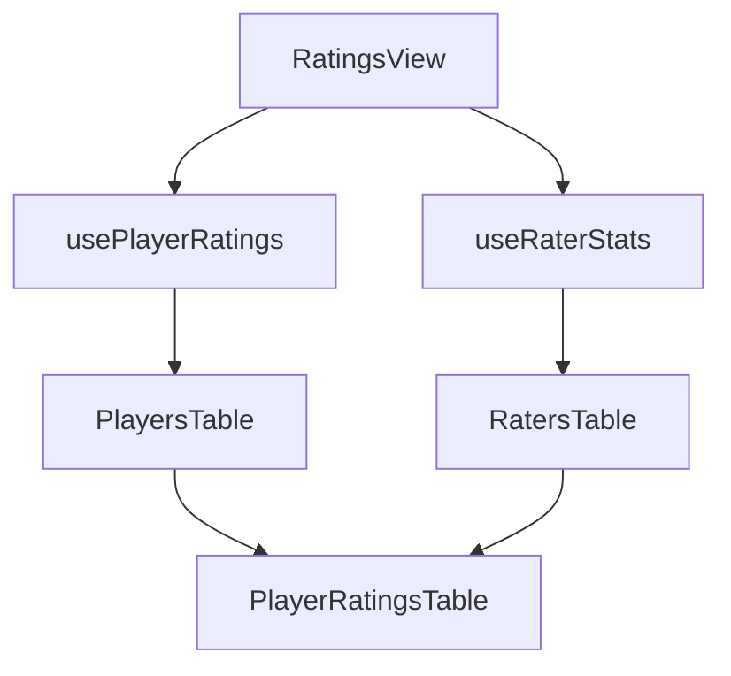

# Ratings System Guide

## Overview
The WNF Ratings System allows players to confidentially rate other players they have played with, provided they meet certain criteria. Players can rate skills (Attack, Defense, Game IQ, GK), select positions where players excel, and assign playstyles. This document explains both the player-facing and administrative aspects of the ratings system.

## Table of Contents
- [Player Rating System](#player-rating-system)
  - [Rating Criteria](#rating-criteria)
  - [Rating Process](#rating-process)
  - [Position Preferences](#position-preferences)
- [Administrative Interface](#administrative-interface)
  - [Accessing the Admin Panel](#accessing-the-admin-panel)
  - [Interface Components](#interface-components)
  - [Data Views](#data-views)
  - [Sorting and Filtering](#sorting-and-filtering)
- [Technical Implementation](#technical-implementation)
  - [Component Structure](#component-structure)
  - [Data Flow](#data-flow)
  - [Security Considerations](#security-considerations)

## Player Rating System

### Rating Criteria
- Players can rate others only after playing 5 games with them
- Ratings are confidential and only visible to administrators
- Players can rate attack, defense, game IQ, and GK skills on a scale of 0-10
- Players can also assign playstyles to complement the core ratings

### Rating Definitions
- **Attack Rating**: Measures both offensive skills AND tendency to play in attacking positions
- **Defense Rating**: Measures both defensive skills AND tendency to play in defensive positions
- **Game IQ Rating**: Measures tactical awareness, positioning, decision-making, and understanding of game flow
- **GK Rating**: Measures goalkeeper ability including shot-stopping, positioning, distribution, command of area, and 1v1 ability

### Rating Process
1. After completing a game, eligible players can rate their teammates
2. Ratings are stored securely in the database
3. Multiple ratings from the same player are tracked historically

### Rating Modal & Entry Points

**Added:** November 21, 2025

The rating modal provides a comprehensive interface for rating players, including all four core metrics (Attack, Defense, Game IQ, GK), position preferences, and playstyle attributes. This modal is available in two places:

#### 1. Ratings Page (`/ratings`)
- **Primary Rating Interface**: Dedicated page for rating all eligible players
- **Player List View**: Shows all players you can rate with filtering/sorting
- **Bulk Rating Workflow**: Designed for rating multiple players in sequence
- **Path**: `src/pages/Ratings.tsx`

#### 2. Player Profile Page (`/player/:id`)
- **Individual Player Context**: Rate a specific player while viewing their profile
- **Quick Access**: Direct rating without navigating to main ratings page
- **Same Functionality**: Identical modal with all features (GK rating, position preferences, playstyle)
- **Path**: `src/pages/PlayerProfile.tsx`

#### Shared Modal Component

Both pages use the same `RatingModal` component (`src/components/profile/RatingModal.tsx`) ensuring consistency:

**Features:**
- **Four Core Ratings**: Attack (0-10), Defense (0-10), Game IQ (0-10), GK (0-10)
- **Position Selector**: Ranked selection (Gold/Silver/Bronze) for up to 3 positions
- **Playstyle Selector**: 6 derived attributes (Pace, Shooting, Passing, Dribbling, Defending, Physical)
- **ViewAs Mode**: Shows warning when admin is testing with permission emulation
- **Data Persistence**: Saves to `player_ratings` and `player_position_ratings` tables

**Type Structure:**
```typescript
my_rating?: {
  attack_rating: number;
  defense_rating: number;
  game_iq_rating: number;
  gk_rating: number;
} | null;
```

**Rating Lifecycle:**
1. **Load**: Existing ratings/positions fetched from database on modal open
2. **Edit**: User modifies ratings, positions, and playstyle attributes
3. **Save**: Data persisted to database via upsert (ratings) and delete+insert (positions)
4. **Refresh**: Player profile data updates to reflect new ratings

### Position Preferences

**Added:** 2025-11-12
**Updated to Ranked System:** 2025-11-13
**GK Removed:** 2025-11-21

#### What Position Preferences Show
Position preferences indicate WHERE a player excels on the pitch across 11 outfield positions (GK removed due to rotating goalkeeper system):
- 🛡️ **Defense**: LB (Left Back), CB (Center Back), RB (Right Back), LWB (Left Wing Back), RWB (Right Wing Back)
- ⚙️ **Midfield**: LW (Left Winger), CM (Center Mid), RW (Right Winger), CAM (Attacking Mid), CDM (Defensive Mid)
- ⚔️ **Attack**: ST (Striker)

#### Ranked System
Instead of selecting multiple positions, raters now **rank up to 3 positions** in order of where the player excels most:

**Point System:**
- 🥇 **1st Choice (Gold)**: 3 points - Best position
- 🥈 **2nd Choice (Silver)**: 2 points - Secondary position
- 🥉 **3rd Choice (Bronze)**: 1 point - Tertiary position

**Consensus Calculation:**
- Percentage = (Total Points / (Total Raters × 6 max points)) × 100
- Example: 5 raters all pick "ST" as 1st choice = 15 points / 30 possible = 50% consensus

#### Benefits of Ranked System
- **Forces Critical Thinking**: Must decide the BEST position, not just all possible positions
- **Natural Limit**: Maximum 3 positions prevents spam ratings
- **Better Consensus**: Weighted points show strength of position preference, not just occurrence
- **Minimum Threshold**: Position data only shown after 5+ raters have provided input

#### Consensus Tiers
- **Primary (50%+)**: Strong consensus, shown with solid primary badge
- **Secondary (25-49%)**: Moderate consensus, shown with lighter badge
- **Mentioned (<25%)**: Weak consensus, not displayed in primary views

#### Team Balancing Impact
Position preferences are used by the team balancing algorithm to prevent tactical imbalances:
- **Hard Constraint**: Prevents teams from having 3+ more players in any position category
- **Categories**: Goalkeeper, Defense, Midfield, Attack
- **Primary Position Used**: Only positions with ≥50% consensus are considered
- **Example**: If one team would get 4 strikers and the other only 1, the algorithm will reject that configuration

#### Use Cases
- **Prevents clustering**: Addresses situations like multiple strikers being assigned to the same team
- **Tactical balance**: Ensures teams have appropriate coverage across all areas of the pitch
- **Formation planning**: Helps coaches understand player versatility and optimal positioning

#### Database Structure
- `player_position_ratings`: Individual ranked selections (rank 1/2/3) from each rater
- `player_position_consensus`: Pre-calculated percentages with rank counts (rank_1_count, rank_2_count, rank_3_count)
- **Trigger**: Automatically recalculates consensus and weighted points when ratings change
- **History Table**: `player_ratings_history` tracks position changes with position_1st/2nd/3rd fields

## Administrative Interface

### Accessing the Admin Panel
- Located at `/admin/ratings`
- Requires super-admin privileges
- Uses secure authentication via Supabase

### Interface Components

#### Tabs
1. **Ratings Received** (default view)
   - Shows all players and their received ratings
   - Displays aggregate statistics
   - Allows drilling down into individual ratings

2. **Ratings Given**
   - Shows all raters and their rating history
   - Helps identify rating patterns
   - Displays playstyle assignments
   - Useful for monitoring rating behavior

3. **Player Attributes**
   - Radar chart visualization of derived attributes
   - Compare up to 4 players
   - Shows 6 attributes from playstyle ratings
   - Mobile responsive design

#### Tables
1. **Players/Raters Table**
   - Left panel showing list of players/raters
   - Sortable columns
   - Search functionality
   - Selection highlighting

2. **Ratings Details Table**
   - Right panel showing detailed ratings
   - Different views for received vs. given ratings
   - Temporal information included

### Data Views

#### Ratings Received View
- Shows who rated each player
- Displays individual attack, defense, game IQ, and GK ratings
- Includes timestamp information
- Sortable by rater name, ratings, or date

#### Ratings Given View
- Shows who each player has rated
- Displays given attack, defense, game IQ, and GK ratings
- Includes timestamp information
- Sortable by rated player name, ratings, or date

### Sorting and Filtering

#### Sorting Options
- Player/Rater Name (alphabetical)
- Attack Rating (numerical)
- Defense Rating (numerical)
- Game IQ Rating (numerical)
- GK Rating (numerical)
- Date (chronological)

#### Filtering
- Search by player name
- Filter by rating ranges (Attack, Defense, Game IQ, GK)
- **Filter by Position** (Added 2025-11-13, Updated 2025-11-21)
  - Multi-select checkboxes organized by category
  - Filters players by primary positions (≥50% consensus)
  - Shows selected count and clear button
  - Position categories: Defense, Midfield, Attack (Goalkeeper removed due to rotating GK system)

### Position System Integration (Admin)

**Added:** 2025-11-13

The admin ratings interface now includes comprehensive position data across all three tabs:

#### 1. Ratings Received Tab

**Players Table - Position Consensus Column:**
- Shows primary positions (≥50% consensus) for each player
- Format: "LB 75%, CB 60%" with percentage badges
- Tooltip displays detailed breakdown:
  - Rating count and total raters
  - Rank distribution (🥇/🥈/🥉 counts)
- Status indicators:
  - "Need X more raters" if <5 raters
  - "No primary positions" if no position ≥50%
- Mobile view: Compact display showing top 2 positions

**Ratings Details Table - Positions Column:**
- Shows ranked positions (🥇1st, 🥈2nd, 🥉3rd) for each rating
- Color-coded badges:
  - Gold (#FCD34D) for 1st choice
  - Silver (#9CA3AF) for 2nd choice
  - Bronze (#EA580C) for 3rd choice
- Shows "-" if no positions rated
- Mobile view: Inline display with position badges

#### 2. Ratings Given Tab

**Raters Table:**
- Same format as Ratings Received tab
- Shows position consensus for players being rated

**Ratings Details Table:**
- Same ranked badge display as Received tab
- Shows positions selected by the rater for each player

#### 3. Attributes Comparison Tab

**Position Consensus Comparison Table:**
- Displays when players are selected for comparison (1-4 players)
- Columns:
  - Player name
  - Primary Positions (≥50%) with percentages
  - Secondary Positions (25-49%) with percentages
  - Data Status (sufficient/need more/not rated)
- Color coding:
  - Primary: Primary blue badges
  - Secondary: Warning yellow badges
  - Status: Success/Warning/Ghost badges
- Tooltips show full rank breakdown

#### Recent Activity Feed

**Position Change Tracking:**
- Shows position changes alongside rating changes
- Visual indicators:
  - Green "+" for positions added
  - Yellow "⟳" for positions changed
  - Strikethrough for positions removed
  - Unchanged positions shown normally
- Ranked badges with medal emojis
- Mobile responsive design

#### Position Filter Panel

**Multi-Select Interface (Updated: 2025-11-21):**
- Organized by 3 categories (Defense, Midfield, Attack)
- Checkboxes for all 11 outfield positions (GK removed from position preferences system)
- Shows selected count
- Clear all button
- Help text: "Filters players by their primary positions (≥50% consensus)"
- Note: Goalkeeper position removed from preferences due to rotating GK system (GK still exists as a rating metric)

#### Position Heatmap Visualization

**NEW Component (Updated: 2025-11-21)** - Comprehensive league-wide analysis:
- **Layout**: Rows (players) × Columns (11 outfield positions - GK removed from position preferences)
- **Cell Display**:
  - Percentage or "-" for no rating
  - Color gradient based on consensus strength
  - Opacity varies (0.3 to 1.0) for visual emphasis
- **Color Coding**:
  - Success (≥75%): Strong primary position
  - Primary (50-74%): Primary position
  - Warning (25-49%): Secondary position
  - Info (<25%): Mentioned position
  - Base (0%): Not rated
- **Tooltips**:
  - Detailed consensus percentage
  - Rating count and total raters
  - Rank distribution (🥇/🥈/🥉 counts)
- **Status Indicators**:
  - Shows "need X more" if <5 raters
  - Grays out insufficient data
- **Interactivity**:
  - Click player row to select
  - Horizontal scroll for large datasets
- **Legend**: Visual guide for color meanings

**Use Cases:**
- Quick identification of versatile players
- League-wide position distribution analysis
- Spotting position gaps or concentrations
- Data quality assessment (who needs more ratings)

## Technical Implementation

### Component Structure

#### Main Components
1. `RatingsView` (`src/pages/admin/ratings.tsx`)
   - Main container component
   - Handles tab state and data loading
   - Manages player/rater selection

2. `PlayerRatingsTable` (`src/components/admin/ratings/components/PlayerRatingsTable.tsx`)
   - Displays detailed ratings
   - Handles both received and given ratings modes
   - Implements sorting logic

3. `PlayersTable` and `RatersTable`
   - Display lists of players and raters
   - Handle selection and sorting
   - Implement search functionality

#### Custom Hooks
1. `usePlayerRatings`
   - Fetches and manages player ratings data
   - **Now includes**: Position consensus and individual position ratings
   - Groups positions by rater_id (first/second/third structure)
   - Attaches position data to each rating object
   - Handles loading and error states
   - Implements security checks

2. `useRaterStats`
   - Fetches and manages rater statistics
   - **Now includes**: Position data for ratings given by each rater
   - Groups positions by rated_player_id
   - Handles loading and error states
   - Implements security checks

3. `useRecentRatings`
   - Fetches recent rating activity with change tracking
   - **Now includes**: Current and previous position data
   - Fetches from `player_ratings_history` for previous values
   - Supports position change detection and visualization

4. `usePlayerFiltering`
   - Filters players based on search term and filter config
   - **Now includes**: Position-based filtering
   - Filters by primary positions (≥50% consensus)
   - Empty position filter array = show all players

### Data Flow


### Security Considerations
1. **Authentication**
   - Super-admin privileges required
   - Secure session management
   - Rate limiting on API calls

2. **Data Access**
   - Row-level security in Supabase
   - Admin-only database views
   - Encrypted data transmission

3. **Error Handling**
   - Graceful degradation
   - User-friendly error messages
   - Comprehensive error logging

## User Interface Features

### Ratings Explanation Component
- Located at the top of the ratings page
- Expandable/collapsible sections using Framer Motion animations
- Provides detailed explanations for each rating type
- Emphasizes importance of honest ratings
- Component path: `/src/components/ratings/RatingsExplanation.tsx`

## Related Documentation
- [Player Selection Explained](./PlayerSelectionExplained.md)
- [Game Flow](./GameFlow.md)
- [XP System Explained](./XPSystemExplained.md)
- [Game IQ Rating Feature](./features/GameIQRating.md)

## Recent Updates
- Added support for both received and given ratings views
- Improved error handling in ratings table
- Enhanced sorting functionality
- Added null safety checks for player data
- Added expandable ratings explanation section (June 26, 2025)
- Integrated Game IQ rating throughout the system
- Added GK (Goalkeeper) rating feature (October 8, 2025)
- **Added Position Preferences feature (November 12, 2025)**
  - 12 standard positions (GK, LB, CB, RB, LWB, RWB, LW, CM, RW, CAM, CDM, ST)
  - Ranked system (1st/2nd/3rd choices with weighted points)
  - Consensus-based aggregation (5 rater minimum, percentage display)
  - Hard constraint in team balancing (max 2 player gap per category)
  - Addresses tactical clustering issues (e.g., multiple strikers on same team)
- **Admin Interface Position Integration (November 13, 2025)**
  - Position consensus columns in Players/Raters tables
  - Ranked position badges (🥇🥈🥉) in ratings details
  - Position change tracking in Recent Activity feed
  - Multi-select position filter panel
  - Position Heatmap visualization component
  - Position consensus comparison in Attributes tab
  - Full mobile responsiveness across all position features
  - Comprehensive tooltips with rank breakdowns
- **Rating Modal Feature Parity (November 21, 2025)**
  - PlayerProfile.tsx now includes comprehensive rating modal (previously only on Ratings.tsx)
  - Both pages provide identical functionality: GK rating + Position preferences + Playstyle selection
  - Shared RatingModal component ensures consistency across rating entry points
  - Position preferences load/save correctly in both Ratings and PlayerProfile contexts
  - Type definitions updated: `my_rating` includes `gk_rating` field
- **GK Removed from Position Preferences (November 21, 2025)**
  - Goalkeeper position removed from position preferences system (rotating GK system)
  - 11 outfield positions remain (LB, CB, RB, LWB, RWB, LW, CM, RW, CAM, CDM, ST)
  - GK still exists as a core rating metric (0-10 scale)
  - Filter panels updated to reflect 3 categories: Defense, Midfield, Attack
  - Database migration removed existing GK position ratings with rank promotion
