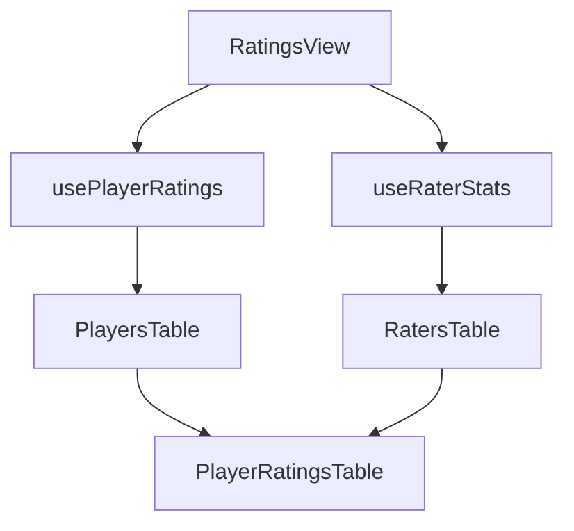

# Ratings System Guide

## Overview
The WNF Ratings System allows players to confidentially rate other players they have played with, provided they meet certain criteria. This document explains both the player-facing and administrative aspects of the ratings system.

## Table of Contents
- [Player Rating System](#player-rating-system)
  - [Rating Criteria](#rating-criteria)
  - [Rating Process](#rating-process)
- [Administrative Interface](#administrative-interface)
  - [Accessing the Admin Panel](#accessing-the-admin-panel)
  - [Interface Components](#interface-components)
  - [Data Views](#data-views)
  - [Sorting and Filtering](#sorting-and-filtering)
- [Technical Implementation](#technical-implementation)
  - [Component Structure](#component-structure)
  - [Data Flow](#data-flow)
  - [Security Considerations](#security-considerations)

## Player Rating System

### Rating Criteria
- Players can rate others only after playing 5 games with them
- Ratings are confidential and only visible to administrators
- Players can rate both attack and defense skills on a scale of 0-10

### Rating Process
1. After completing a game, eligible players can rate their teammates
2. Ratings are stored securely in the database
3. Multiple ratings from the same player are tracked historically

## Administrative Interface

### Accessing the Admin Panel
- Located at `/admin/ratings`
- Requires super-admin privileges
- Uses secure authentication via Supabase

### Interface Components

#### Tabs
1. **Ratings Received** (default view)
   - Shows all players and their received ratings
   - Displays aggregate statistics
   - Allows drilling down into individual ratings

2. **Ratings Given**
   - Shows all raters and their rating history
   - Helps identify rating patterns
   - Useful for monitoring rating behavior

#### Tables
1. **Players/Raters Table**
   - Left panel showing list of players/raters
   - Sortable columns
   - Search functionality
   - Selection highlighting

2. **Ratings Details Table**
   - Right panel showing detailed ratings
   - Different views for received vs. given ratings
   - Temporal information included

### Data Views

#### Ratings Received View
- Shows who rated each player
- Displays individual attack and defense ratings
- Includes timestamp information
- Sortable by rater name, ratings, or date

#### Ratings Given View
- Shows who each player has rated
- Displays given attack and defense ratings
- Includes timestamp information
- Sortable by rated player name, ratings, or date

### Sorting and Filtering

#### Sorting Options
- Player/Rater Name (alphabetical)
- Attack Rating (numerical)
- Defense Rating (numerical)
- Date (chronological)

#### Filtering
- Search by player name
- Filter by rating ranges
- Filter by date ranges (if implemented)

## Technical Implementation

### Component Structure

#### Main Components
1. `RatingsView` (`src/pages/admin/ratings.tsx`)
   - Main container component
   - Handles tab state and data loading
   - Manages player/rater selection

2. `PlayerRatingsTable` (`src/components/admin/ratings/components/PlayerRatingsTable.tsx`)
   - Displays detailed ratings
   - Handles both received and given ratings modes
   - Implements sorting logic

3. `PlayersTable` and `RatersTable`
   - Display lists of players and raters
   - Handle selection and sorting
   - Implement search functionality

#### Custom Hooks
1. `usePlayerRatings`
   - Fetches and manages player ratings data
   - Handles loading and error states
   - Implements security checks

2. `useRaterStats`
   - Fetches and manages rater statistics
   - Handles loading and error states
   - Implements security checks

### Data Flow

### Security Considerations
1. **Authentication**
   - Super-admin privileges required
   - Secure session management
   - Rate limiting on API calls

2. **Data Access**
   - Row-level security in Supabase
   - Admin-only database views
   - Encrypted data transmission

3. **Error Handling**
   - Graceful degradation
   - User-friendly error messages
   - Comprehensive error logging

## Related Documentation
- [Player Selection Explained](./PlayerSelectionExplained.md)
- [Game Flow](./GameFlow.md)
- [XP System Explained](./XPSystemExplained.md)

## Recent Updates
- Added support for both received and given ratings views
- Improved error handling in ratings table
- Enhanced sorting functionality
- Added null safety checks for player data
