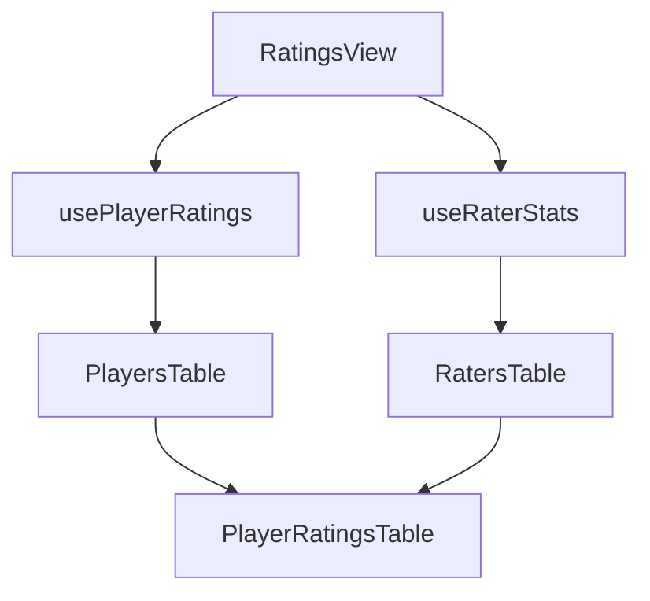

# Ratings System Guide

## Overview
The WNF Ratings System allows players to confidentially rate other players they have played with, provided they meet certain criteria. Players can rate skills (Attack, Defense, Game IQ, GK), select positions where players excel, and assign playstyles. This document explains both the player-facing and administrative aspects of the ratings system.

## Table of Contents
- [Player Rating System](#player-rating-system)
  - [Rating Criteria](#rating-criteria)
  - [Rating Process](#rating-process)
  - [Position Preferences](#position-preferences)
- [Administrative Interface](#administrative-interface)
  - [Accessing the Admin Panel](#accessing-the-admin-panel)
  - [Interface Components](#interface-components)
  - [Data Views](#data-views)
  - [Sorting and Filtering](#sorting-and-filtering)
- [Technical Implementation](#technical-implementation)
  - [Component Structure](#component-structure)
  - [Data Flow](#data-flow)
  - [Security Considerations](#security-considerations)

## Player Rating System

### Rating Criteria
- Players can rate others only after playing 5 games with them
- Ratings are confidential and only visible to administrators
- Players can rate attack, defense, game IQ, and GK skills on a scale of 0-10
- Players can also assign playstyles to complement the core ratings

### Rating Definitions
- **Attack Rating**: Measures both offensive skills AND tendency to play in attacking positions
- **Defense Rating**: Measures both defensive skills AND tendency to play in defensive positions
- **Game IQ Rating**: Measures tactical awareness, positioning, decision-making, and understanding of game flow
- **GK Rating**: Measures goalkeeper ability including shot-stopping, positioning, distribution, command of area, and 1v1 ability

### Rating Process
1. After completing a game, eligible players can rate their teammates
2. Ratings are stored securely in the database
3. Multiple ratings from the same player are tracked historically

### Position Preferences

**Added:** 2025-11-12

#### What Position Preferences Show
Position preferences indicate WHERE a player excels on the pitch across 11 standard positions:
- 🥅 **Goalkeeper**: GK
- 🛡️ **Defense**: LB (Left Back), CB (Center Back), RB (Right Back), WB (Wing Back)
- ⚙️ **Midfield**: LM (Left Mid), CM (Center Mid), RM (Right Mid), CAM (Attacking Mid), CDM (Defensive Mid)
- ⚔️ **Attack**: ST (Striker)

#### How It Works
- **Multi-Select**: Raters can select 1-3 positions where a player excels (warning if selecting more than 3)
- **Consensus-Based**: System aggregates selections from multiple raters to show percentage consensus
- **Display Format**: "LB 75%, CB 60%" (primary positions with 50%+ consensus shown first)
- **Minimum Threshold**: Position data only displayed after 5+ raters have provided input

#### Consensus Tiers
- **Primary (50%+)**: Strong consensus, shown with solid primary badge
- **Secondary (25-49%)**: Moderate consensus, shown with lighter badge
- **Mentioned (<25%)**: Weak consensus, not displayed

#### Team Balancing Impact
Position preferences are used by the team balancing algorithm to prevent tactical imbalances:
- **Hard Constraint**: Prevents teams from having 3+ more players in any position category
- **Categories**: Goalkeeper, Defense (LB/CB/RB/WB/CDM), Midfield (LM/CM/RM/CAM), Attack (ST)
- **Example**: If one team would get 4 strikers and the other only 1, the algorithm will reject that configuration

#### Use Cases
- **Prevents clustering**: Addresses situations like Tom K (physical striker) and Stephen (pace striker) both being assigned to the same team despite different physical profiles
- **Tactical balance**: Ensures teams have appropriate coverage across the pitch
- **Formation planning**: Helps coaches understand player versatility

#### Database Structure
- `player_position_ratings`: Individual position selections from each rater
- `player_position_consensus`: Pre-calculated percentages updated via trigger
- **Trigger**: Automatically recalculates consensus when ratings change

## Administrative Interface

### Accessing the Admin Panel
- Located at `/admin/ratings`
- Requires super-admin privileges
- Uses secure authentication via Supabase

### Interface Components

#### Tabs
1. **Ratings Received** (default view)
   - Shows all players and their received ratings
   - Displays aggregate statistics
   - Allows drilling down into individual ratings

2. **Ratings Given**
   - Shows all raters and their rating history
   - Helps identify rating patterns
   - Displays playstyle assignments
   - Useful for monitoring rating behavior

3. **Player Attributes**
   - Radar chart visualization of derived attributes
   - Compare up to 4 players
   - Shows 6 attributes from playstyle ratings
   - Mobile responsive design

#### Tables
1. **Players/Raters Table**
   - Left panel showing list of players/raters
   - Sortable columns
   - Search functionality
   - Selection highlighting

2. **Ratings Details Table**
   - Right panel showing detailed ratings
   - Different views for received vs. given ratings
   - Temporal information included

### Data Views

#### Ratings Received View
- Shows who rated each player
- Displays individual attack, defense, game IQ, and GK ratings
- Includes timestamp information
- Sortable by rater name, ratings, or date

#### Ratings Given View
- Shows who each player has rated
- Displays given attack, defense, game IQ, and GK ratings
- Includes timestamp information
- Sortable by rated player name, ratings, or date

### Sorting and Filtering

#### Sorting Options
- Player/Rater Name (alphabetical)
- Attack Rating (numerical)
- Defense Rating (numerical)
- Game IQ Rating (numerical)
- GK Rating (numerical)
- Date (chronological)

#### Filtering
- Search by player name
- Filter by rating ranges
- Filter by date ranges (if implemented)

## Technical Implementation

### Component Structure

#### Main Components
1. `RatingsView` (`src/pages/admin/ratings.tsx`)
   - Main container component
   - Handles tab state and data loading
   - Manages player/rater selection

2. `PlayerRatingsTable` (`src/components/admin/ratings/components/PlayerRatingsTable.tsx`)
   - Displays detailed ratings
   - Handles both received and given ratings modes
   - Implements sorting logic

3. `PlayersTable` and `RatersTable`
   - Display lists of players and raters
   - Handle selection and sorting
   - Implement search functionality

#### Custom Hooks
1. `usePlayerRatings`
   - Fetches and manages player ratings data
   - Handles loading and error states
   - Implements security checks

2. `useRaterStats`
   - Fetches and manages rater statistics
   - Handles loading and error states
   - Implements security checks

### Data Flow

### Security Considerations
1. **Authentication**
   - Super-admin privileges required
   - Secure session management
   - Rate limiting on API calls

2. **Data Access**
   - Row-level security in Supabase
   - Admin-only database views
   - Encrypted data transmission

3. **Error Handling**
   - Graceful degradation
   - User-friendly error messages
   - Comprehensive error logging

## User Interface Features

### Ratings Explanation Component
- Located at the top of the ratings page
- Expandable/collapsible sections using Framer Motion animations
- Provides detailed explanations for each rating type
- Emphasizes importance of honest ratings
- Component path: `/src/components/ratings/RatingsExplanation.tsx`

## Related Documentation
- [Player Selection Explained](./PlayerSelectionExplained.md)
- [Game Flow](./GameFlow.md)
- [XP System Explained](./XPSystemExplained.md)
- [Game IQ Rating Feature](./features/GameIQRating.md)

## Recent Updates
- Added support for both received and given ratings views
- Improved error handling in ratings table
- Enhanced sorting functionality
- Added null safety checks for player data
- Added expandable ratings explanation section (June 26, 2025)
- Integrated Game IQ rating throughout the system
- Added GK (Goalkeeper) rating feature (October 8, 2025)
- **Added Position Preferences feature (November 12, 2025)**
  - 11 standard positions (GK, LB, CB, RB, WB, LM, CM, RM, CAM, CDM, ST)
  - Consensus-based aggregation (5 rater minimum, percentage display)
  - Multi-select UI with 1-3 position recommendation
  - Hard constraint in team balancing (max 2 player gap per category)
  - Addresses tactical clustering issues (e.g., multiple strikers on same team)
